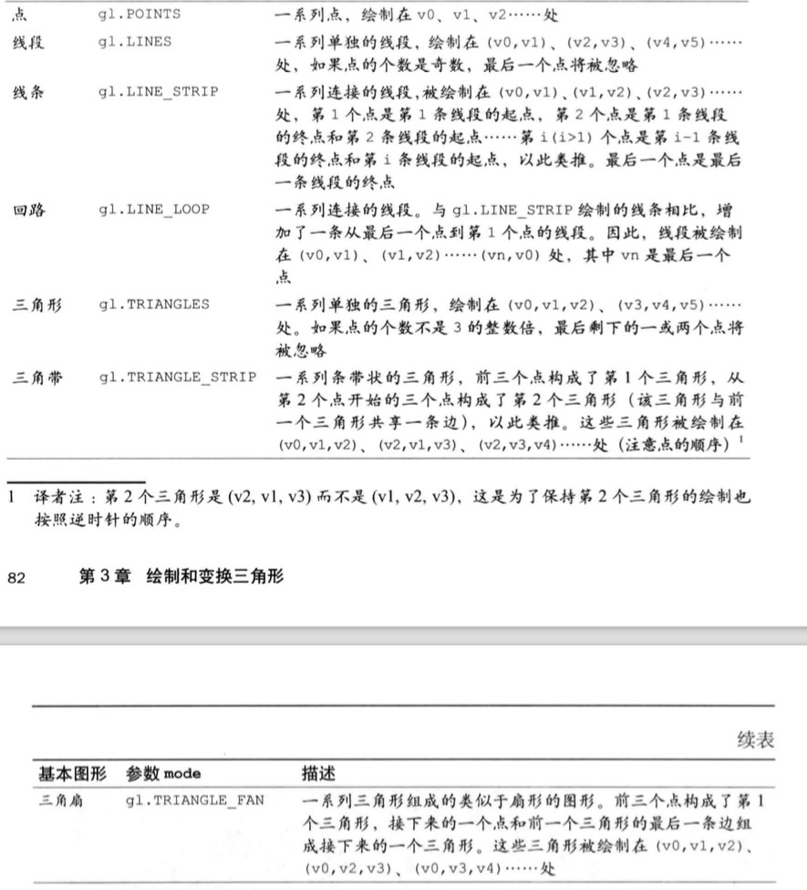
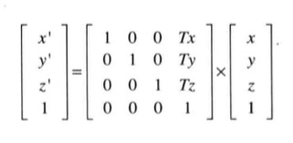
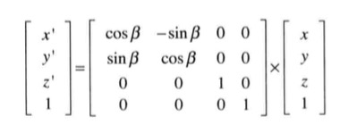
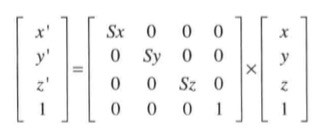
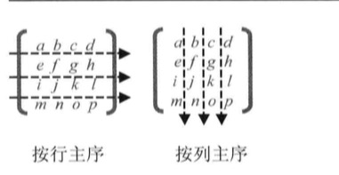
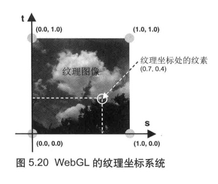

#webGL编程指南demo及笔记

## 目录
1. [第二章](#chpter02)
2. [第三章](#chpter03)
3. [第四章](#chpter04)
4. [第五章](#chpter05)

<a name="chpter02"></a>
## 第二章
- 获取绘图环境`gl = canvasElement.getContext('webgl')`
- 设置背景颜色`gl.clearColor(0.0,0.0,0.0,0.8)` 黑色透明度为0.8，每个参数取值在0.0~1.0之间
- 使用背景色清空绘图区域 `gl.clear(gl.COLOR_BUFFER_BIT)`

### gl.clear(buffer)
参数 buffer
- `gl.COLOR_BUFFER_BIT`   - 指定颜色缓存
- `gl.DEPTH_BUFFER_BIT`   - 指定深度缓冲区
- `gl.STENCIL_BUFFER_BIT` - 指定模板缓冲区

### 着色器
在三维场景中，仅仅用线条和颜色把图形画出来是远远不够的。还需要考虑光照射上去之后，或者观察者视角发生变化等对场景的影响。
- 着色器是以js字符串的形式编写着色器语言OpenGL ES 着色器语言（GLSL ES）
- 顶点着色器（Vertex shader）:顶点着色器是用来描述顶点特性（如位置、颜色等）的程序。
顶点（vertex）是指二维或三维空间中的一个点，比如二维或三维图形的端点或交点。
- 片元着色器（Fragment shader）:进行逐片元处理过程如光照的程序。片元（Fragment）是一个WBEGL术语，可以理解为含有一个像素的位置，颜色和其他信息的信息集合。
  - gl_FragColor:片元着色器唯一的内置变量，它控制着像素在屏幕上的最终颜色。
- 齐次坐标（x,y,z,w）等价于三维坐标（x/w,y/w,z/w）.

### 绘制
- gl.drawArrays(mode, first, count)
  `mode`: 指定绘制的方式，可选参数有`gl.POINTS`,`gl.LINES`,`gl.LINE_STRIP`,`gl.LINE_LOOP`,`gl.TRIANGLES`,`gl.TRIANGLE_STRIP`,`gl.TRIANGLE_FAN`
  `first`: 指定从那个点开始绘制（整数）
  `count`: 指定绘制需要用到多少个顶点（整数）
  当程序调用gl.drawArrays()时，顶点着色器将执行count次，每次处理一个顶点。一旦顶点着色器执行完之后，片元着色器就会开始执行，将颜色赋值给gl_FragColor

### 在js中将位置信息传给顶点着色器
- attribute变量：传输与顶点位置相关的数据
```glsl
  attribute vec4 a_Position
```
attribute变量声明必须成全局变量，数据将从着色器外部传给该变量。
<存储限定符><类型><变量名>
- 获取attribute变量
先要向WebGL系统获取变量的存储地址，然后才能拿该变量传输数据。
`gl.getAttribLocation(program,name)`
  - `program`:指定包含顶点着色器和片元着色器的着色器程序对象
    ```javascript
      gl.vertexAttrib1f(location, v0)
      gl.vertexAttrib2f(location, v0, v1)
      gl.vertexAttrib3f(location, v0, v1, v2)
      gl.vertexAttrib4f(location, v0, v1, v2, v3)

      var postion = new Float32Array([1.0,2.0,3.0,1.0])
      gl.vertexAttrib4fv(location, postion) // 带有v表示可以接受数组作为参数
    ```
  - `location`:修改的attribute变量的存储位置

- uniform变量：传输所有顶点都相同或者无关的数据
  `gl.getUniformLocation`
  `gl.uniform4fv(u_FragColor,g_colors[i])`

### 总结
顶点着色器进行的是逐顶点的操作，片元着色器进行的是逐片元的操作。

<a name="chpter03"></a>
## 第三章

### 使用缓存区对象向顶点着色器传输多个顶点的数据。
- 创建缓冲区对象（gl.createBuffer()）
- 绑定缓冲区对象（gl.bindBuffer()）
- 将数据写入缓冲区对象 (gl.bufferData())
- 将缓冲区对象分配给一个attribute变量 （gl.vertexAttribPointer）
- 开启attribute变量（gl.enableVertexAttribArray）

### 创建缓冲区对象
- gl.createBuffer() 成功返回值非null.失败返回null
- gl.deleteBuffeer(buffer) 无返回值

### 绑定缓冲区对象
将缓冲区对象绑定到webGL系统中已经存在的“目标”上。

- `gl.bindBuffer(target,buffer)`
target：可取值为`gl.ARRAY_BUFFER`,`gl.ELEMENT_ARRAY_BUFFER`
  + `gl.ARRAY_BUFFER `表示缓冲区对象中包含了顶点的数据
  + `gl.ELEMENT_ARRAY_BUFFER`表示缓冲区对象中包含了顶到的索引值

### 将数据写入缓冲区对象
`gl.bufferData(target, data, usage)`,将`variable`中的数据写入绑定了`gl.ARRAY_BUFFER`上的缓冲区对象。我们不能直接向缓冲区写入数据，而只能向`target`写入数据，所以要向缓冲区写数据，必须先绑定。

### 类型化数组
创建类型化数组唯一的方法是使用`new`运算符
- get(index)
- set(index,value)
- set(array, offset)
- length
- BYTES_PER_ELEMENT

### 将缓冲区对象分配给attribute变量
**gl.vertexAttribPointer(location, size, type, normalized, stride, offset)**
- location:指待分配attribute变量的存储位置
- size:指定缓冲区中每个顶点的分量个数（1到4）。若size比attribute变量需要的分量小，缺失分量会自动补齐。
- type:
  + gl.UNSIGNED_BYTE 无符号字节，Uint8Array
  + gl.SHORT 短整形，Int16Array
  + gl.UNSIGNED_SHORT 无符号短整形，Uint16Array
  + gl.INT 整形，Int32Array
  + gl.UNSIGNED_INT 无符号整形，Uint32Array
  + gl.FLOAT 浮点型，Float32Array
- normalized: 传入true或者false,表明是否将非浮点型的数据归一化到[0,1]或者[-1,-1]区间
- stride: 只相邻两个顶点间的字节数，默认为0
- offset: 偏移量

### 开启attribute变量
为了使顶点着色器能够访问缓冲区内的数据，需要使用`gl.enableVertexAttribArray(location)`来开启attribute变量。
`gl.disableVertexArray(location)`

### webGL基本图形



### 变化矩阵

- 平移矩阵：


- 旋转矩阵:
、

- 缩放矩阵:


### 按行主序（row major order）和按列主序（column major order）



WebGL和OpenGL都是按列主序

<a name="chpter04"></a>
##第四章
这章主要是调用写好的方法，就不谢笔记了。
- `gl.uniformMatrix4fv(u_ModelMatrix, false, modelMatrix.elements)`

<a name="chpter05"></a>
##第五章

- 图形装配过程：将孤立的坐标点装配成几何图形。几何图形的类别由gl.drawArrays()函数的第一个参数决定。
- 图元光栅化（rasterzation process）表示发送在顶点着色器和片元着色器之间的从图形到片元的转化。

  ```javascript
  var FSIZE = verticesSizes.BYTES_PER_ELEMENT;
  gl.vertexAttribPointer(a_PointSize, 1, gl.FLOAT, false, FSIZE*3, FSIZE*2)
  ```
- varying变量（颜色变量）
  varying变量的作用是从顶点着色器向片元着色器传输数据。即在顶点着色器上使用attribute变量接收数据，然后声明verying变量，用于向attribute接收的数据传递给片元着色器。


- 纹理映射（texture mapping）
  1. 准备好映射到几何图形上的纹理图像
  2. 为几何图形配置纹理映射方式
  3. 加载纹理图像，对其进行一些配置，以在WebGL中使用它
  4. 在片元着色器中将相应的纹素从纹理中抽取出来，并将纹素的颜色赋给片元。

- 纹理坐标（texture coordinates, st坐标系统）


- `STATIC_DRAW`

- 图形Y轴反转
  `gl.pixelStorei(gl.UNPACK_FLIP_Y_WEBGL, 1)`
  WebGL纹理坐标系统中的t轴的方向和PNG,BMP,JPG等格式图片的坐标系统的Y轴方向是相反的。因此，只有先将图像Y轴进行反转，才能够正确地将图像映射到图形上。

  `gk.pixelStorei(gl.UNPACK_PREMULTIPLY_ALPHA_WEBGL, A)`
  将图像RGB颜色值的每一个分量乘以A。默认为false

- 纹理参数`gl.texParameteri(target, pname, param)`
  + `gl.TEXTUGE_MAG_FILTER` 纹理放大 默认-`gl.LINEAR`
  + `gl.TEXTURE_MIN_FILTER` 纹理缩小 默认-`gl.NEAREST_MIPMAP_LINEAR`
  + `gl.TEXTURE_WRAP_S` 纹理水平填充 默认-`gl.REPEAT`
  + `gl.TEXTURE_WRAP_T` 纹理垂直填充 默认-`gl.REPEAT`

  可以赋值给`gl.TEXTURE_MIN_FILTER`,`gl.TEXTUGE_MAG_FILTER`的非金字塔纹理类型常量
  + `gl.NEAREST`: 使用原纹理上距离映射后像素（新像素）中心最近的那个像素的颜色值，作为新像素的值（使用曼哈顿距离：|x1-x2|+|y1-y2|）
  + `gl.LINEAR`: 使用距离新像素中心最近的四个像素的颜色值的加权平均，作为新像素的值（与gl.NEAREST相比，该方法图像质量更好，但是会有较大开销。）

  可以赋值给`gl.TEXTURE_WRAP_T`,`gl.TEXTURE_WRAP_S`的常量
  + `gl.REPEAT`: 平铺试的重复纹理
  + `gl.MIRRORED_REPEAT`: 镜像对称式的重复纹理
  + `gl.CLAMP_TO_EDGE`: 使用纹理图像边缘值

- 将纹理图像分配给纹理对象 （`gl.texImage2D(target, level, internalformat, format, type, image)`）
  + `target`: `gl.TEXTURE_2D`或者`gl.TEXTURE_CUBE_MAP`
  + `level`: 0,(为金字塔纹理准备的)
  + `internalformat`: 图像内部格式
  + `format`: 纹素数据格式,必须使用与`internalformat`相同的值
  + `type`: 纹理数据的类型
  + `image`: 包含纹理图像的Image对象

-  纹素数据格式
  根据纹理图像的格式来选择不同的参数，一般：JPG格式对应`gl.RGB`,PNG格式对应`gl.RGBA`,BMP对应`gl.RGB`,灰度图像对应`gl.LUMINANCE`和`gl.LUMINANCE_ALPHA`
  `流明`：通常使用物体表面红、绿、蓝分量值的加权平均来计算流明。

- 纹理数据的数据格式
  + `gl.UNSIGNED_BYTE` 无符号整型，每个颜色分量占据1字节
  + `gl.UNSIGNED_SHORT_5_6_5` RGB：每个分量分别占据5，6，5比特
  + `gl.UNSIGNED_SHORT_4_4_4_4` RGBA:每个分量分别占据4，4，4，4比特
  + `gl.UNSIGNED_SHORT_5_5_5_1` RGBA:RGB每个分量各占据5比特，A分量占据1比特

- 将纹理单位传递给片元着色器`gl.uniform1i(u_Sampler, texUnit)`

- `vec4 texture2D(sampler2D sampler, vec2 coord)`抽取纹素颜色。

<a name="chpter06"></a>
## 第六章
WebGL并不支持GLSL ES 1.00的所有特性，他是1.00版本的一个子集，其中只包含webgl需要的一些核心特性。GLSL ES编程语言是在OpenGL着色器语言（GLSL）的基础上，删除和简化了一部分功能后形成的。

- 完全数:（Perfect number），又称完美数或完备数，是一些特殊的自然数。它所有的真因子（即除了自身以外的约数）的和（即因子函数），恰好等于它本身。如果一个数恰好等于它的因子之和，则称该数为“完全数”。例如：6=1+2+3,28=1+2+4+7+14
- 卡布列克数：假如正整数X在n进位下的平方可以分割为二个数字，并且这二个数字相加后恰等于X，那么X就是n进位下的卡布列克数。在二进制下，所有的完全数都是卡布列克数。
- 卡布列克常数：任意一个不是用完全相同数字组成的四位数，如果对它们的每位数字重新排序，组成一个较大的数和一个较小的数，然后用较大数减去较小数，差不够四位数时补零，类推下去，最后将变成一个固定的数：6174，这就是卡布列克常数。
- 梅森素数：古希腊数学家欧几里得在名著《几何原本》中证明了素数有无穷多个，并论述完全数时提出：如果2^P-1是素数(其中指数P也是素数)，则2^(P-1)(2^P-1)是完全数。

### 矩阵构造函数
- 向矩阵构造函数中传入矩阵的每一个元素的数值来构造矩阵，注意传入值的顺序是列主序的。
- 向矩阵构造函数中传入一个或多个矢量，按照列主序使用矢量里的元素值来构造矩阵。
- 向矩阵构造函数中传入矢量和数值，按照列主序使用矢量里的元素值和直接传入的数值来构造矩阵。
- 向矩阵构造函数中传入单个数值，这样将生成一个对角线上元素都是该数值，其他元素为0.0的矩阵。

### 分量名
- x,y,z,w 用来获取顶点坐标分量
- r,g,b,a 用来获取颜色分量
- s,t,p,q 用来获取纹理坐标分量
由于矢量可以用来存储顶点坐标，颜色和纹理坐标，所以GLSL ES支持上面的三种分量名称以增强程序的可读性。事实任何矢量的x,r,s分量都会返回第一个分量。

```c
vec3 v3 = vec3(1.0, 2.0, 3.0);
vec2 v2;
v2 = v3.xy; // 设v2为（1.0, 2.0）
v2 = v3.xz; // 设v2为（1.0, 3.0）

vec4 v4 = vec4(1.0, 2.0, 3.0, 4.0)
v4.xw = vec2(5.0, 6.0) // v4为(5.0, 2.0, 3.0, 4.0)
```
注意，多个分量名必须属于同一个集合。

- []运算符
使用[]运算符通过数组下标来访问矢量或矩阵的元素。注意，矩阵中的元素仍然是按照列主序读取的。这里有一个限制，那就是[]中出现的索引值必须是`常量索引值`：
  + 整形字面量（0，1，2等）
  + 用const修饰的全局变量或局部变量，不包括函数参数
  + 循环索引
  + 前面三个项组成的表达式

- 矢量和浮点数的运算

```c
vec3 v3a = vec3(1.0,2.0,3.0);
float f = 1.0;
vac3 v3b = v3a + f; // v3b为（2.0, 3.0, 4.0）
```

- 矢量运算

```c
vec3 v3a = vec3(1.0,2.0,3.0);
vec3 v3b = vec3(3.0,5.0,6.0);
vec3 v3c = v3a + v3b; // v3c为（4.0，7.0，9.0）
```

- 矩阵右乘矢量
